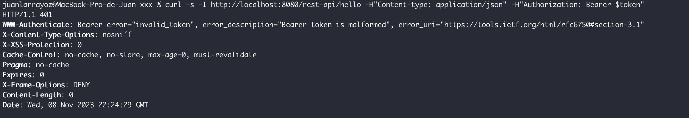
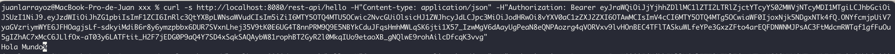

# Proyecto spring-jwt

Este proyecto esta configurado para usar un resource server (Algo así como un filter) de oauth2 para asegurar los servicios REST que contiene.

En el archivo pom.xml se agrego la dependencia:

```xml
	<!-- Starter para habilitar el Resource Server de Oauth2
		Este "filter" es el responsable de asegurar una API, interrogando el request para 
		asegurar que se reciba un token válido -->
		
		<dependency>
			<groupId>org.springframework.boot</groupId>
			<artifactId>spring-boot-starter-oauth2-resource-server</artifactId>
		</dependency>

```

Observar la clase **SecurityConfig.java**. Esta clase tiene la configuración del filterchain para oauth2. En este caso asegura los GET a rest-api/** exigiendo que se posea el rol/scope "SCOPE_pruebas".


Para consumir el WS de ejemplo debemos ejecutar el siguiente comando CURL:

```bash
curl -s http://localhost:8080/rest-api/hello -H"Content-type: application/json" -H"Authorization: Bearer $token"
```

Debemos subsituir $token por un access_token válido.

Si queremos ver los headers de la petición podemos agregar el param -I al comando curl. De esta forma por ejemplo podemos ver si la petición se ejecuta correctamente (status code 200) o si falla por problemas de autenticación (status code 401)

Si tenemos algún problema de autenticación vamos a ver un mensaje como el siguiente:



Esto significa que hubo algún problema con le token y seguramente no sea válido.

Si todo sale correctamente deberíamos ver lo siguiente:



NOTA: para que curl muestre el response entity lo debemos ejecutar solo con el param -s

